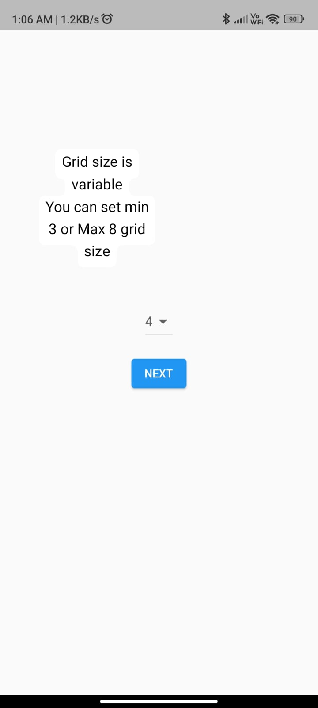

# borardgame

2048 Game with some twist
Game have variable grid size. User can set grid size from minimum 3 x 3 to 8 x 8
Game also shows current score which is determined by the value of the tiles you combine.
Block color changes as value of that block increase

Grid size selection screen

Actual Game Screen

## Getting Started

This project is a starting point for a Flutter application.

A few resources to get you started if this is your first Flutter project:

- [Lab: Write your first Flutter app](https://docs.flutter.dev/get-started/codelab)
- [Cookbook: Useful Flutter samples](https://docs.flutter.dev/cookbook)

For help getting started with Flutter development, view the
[online documentation](https://docs.flutter.dev/), which offers tutorials,
samples, guidance on mobile development, and a full API reference.
