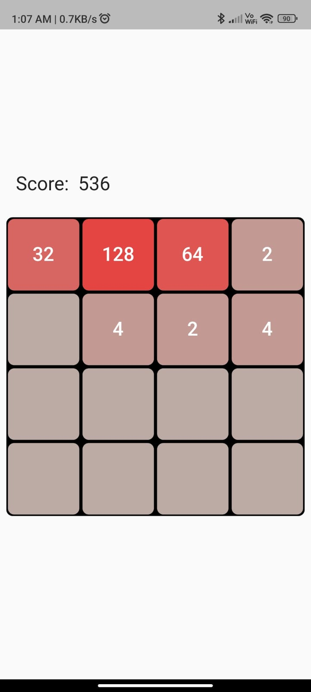

# borardgame

2048 Game with some twist
Game have variable grid size. User can set grid size from minimum 3 x 3 to 8 x 8
Game also shows current score which is determined by the value of the tiles you combine.
Block color changes as value of that block increase

Grid size selection screen

Actual Game Screen

